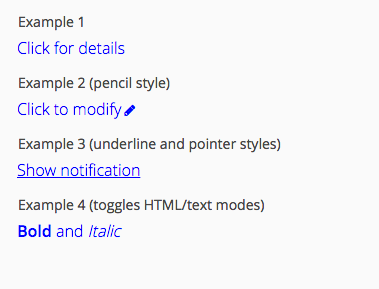

# LabelButton Add-on for Vaadin 7

LabelButton offers way to extends Vaadin's Label with button functionality.

Add-on is originally designed to use case where you want to attach edit functionality to forms labels. This all where
modification requires more complex action than TextField or ComboBox could offer. Usually user would attach some modal
popup window to open after label has been clicked.

Other use case would be to include navigation labels (in style of Links).

If this add-on does not match with your requirements please check Link component from Vaadin core or ClickLabelExtension
from Marko Radinovic (available in Vaadin Directory). 

## Online demo

Try the add-on demo at http://app.siika.fi/LabelButtonDemo

## Build status

[/badge/icon)](http://siika.fi:8888/jenkins/job/LabelButton%20(Vaadin)/)

## Usage Example
```java
LabelButton label = new LabelButton("Caption", "Show notification", event -> Notification.show("Clicked!"));

// Add-on provides some nice styling out-of-box. There add link style underlining and pointer cursor
label.addStyleName(LabelButtonStyles.HOVER_UNDERLINE_WHEN_CLICKABLE);
label.addStyleName(LabelButtonStyles.POINTER_WHEN_CLICKABLE);

parentLayout.add(label);

// .. you can easily jump between normal label and clickable state with
label.setClickable(false); // behaves like normal label
// .. and
label.setClickable(true); // enables all click features and styling
```

## Screenshot



## Download release

Official releases of this add-on are available at Vaadin Directory. For Maven instructions, download and reviews, go to http://vaadin.com/addon/labelbutton

## Release notes

### Version 0.1.3 (TODO)
- TODO

### Version 0.1.2 (2015-07-13)
- 0.1.1 did not resolve the OSGi issue correctly.

### Version 0.1.1 (2015-07-13)
- Mandatory mistake in OSGi bundle fixed

### Version 0.1.0 (2015-07-10)
- Initial release
- Addon OSGi bundled
- Pencil, underline and pointer optional style names included
- Click event includes mouse details
- LabelButton can toggle between clickable and unclickable states

## Building and running demo

git clone https://github.com/alump/LabelButton.git
mvn clean install
cd labelbutton-demo
mvn jetty:run

To see the demo, navigate to http://localhost:8080/

## Development with Eclipse IDE

For further development of this add-on, the following tool-chain is recommended:
- Eclipse IDE
- m2e wtp plug-in (install it from Eclipse Marketplace)
- Vaadin Eclipse plug-in (install it from Eclipse Marketplace)
- JRebel Eclipse plug-in (install it from Eclipse Marketplace)
- Chrome browser

### Importing project

Choose File > Import... > Existing Maven Projects

Note that Eclipse may give "Plugin execution not covered by lifecycle configuration" errors for pom.xml. Use "Permanently mark goal resources in pom.xml as ignored in Eclipse build" quick-fix to mark these errors as permanently ignored in your project. Do not worry, the project still works fine. 

### Debugging server-side

If you have not already compiled the widgetset, do it now by running vaadin:install Maven target for labelbutton project.

If you have a JRebel license, it makes on the fly code changes faster. Just add JRebel nature to your labelbutton-demo project by clicking project with right mouse button and choosing JRebel > Add JRebel Nature

To debug project and make code modifications on the fly in the server-side, right-click the labelbutton-demo project and choose Debug As > Debug on Server. Navigate to http://localhost:8080 to see the application.

### Debugging client-side

The most common way of debugging and making changes to the client-side code is dev-mode. To create debug configuration for it, open labelbutton-demo project properties and click "Create Development Mode Launch" button on the Vaadin tab. Right-click newly added "GWT development mode for labelbutton-demo.launch" and choose Debug As > Debug Configurations... Open up Classpath tab for the development mode configuration and choose User Entries. Click Advanced... and select Add Folders. Choose Java and Resources under labelbutton/src/main and click ok. Now you are ready to start debugging the client-side code by clicking debug. Click Launch Default Browser button in the GWT Development Mode in the launched application. Now you can modify and breakpoints to client-side classes and see changes by reloading the web page. 

Another way of debugging client-side is superdev mode. To enable it, uncomment devModeRedirectEnabled line from the end of DemoWidgetSet.gwt.xml located under labelbutton-demo resources folder and compile the widgetset once by running vaadin:compile Maven target for labelbutton-demo. Refresh labelbutton-demo project resources by right clicking the project and choosing Refresh. Click "Create SuperDevMode Launch" button on the Vaadin tab of the labelbutton-demo project properties panel to create superder mode code server launch configuration and modify the class path as instructed above. After starting the code server by running SuperDevMode launch as Java application, you can navigate to http://localhost:8080/labelbutton-demo/?superdevmode. Now all code changes you do to your client side will get compiled as soon as you reload the web page. You can also access Java-sources and set breakpoints inside Chrome if you enable source maps from inspector settings. 

## Roadmap

High priority features:
- Preventing click event if user is painting the text (issue #1)

Lower priority features:
- Offer change to use there features via Extension pattern if possible

## Issue tracking

The issues for this add-on are tracked on its github.com page at https://github.com/alump/LabelButton/issues
All bug reports and feature requests are appreciated. 

## Contributions

Contributions are welcome, but there are no guarantees that they are accepted as such. Process for contributing is the following:
- Fork this project
- Create an issue to this project about the contribution (bug or feature) if there is no such issue about it already. Try to keep the scope minimal.
- Develop and test the fix or functionality carefully. Only include minimum amount of code needed to fix the issue.
- Refer to the fixed issue in commit
- Send a pull request for the original project
- Comment on the original issue that you have implemented a fix for it

## License & Author

Add-on is distributed under Apache License 2.0. For license terms, see LICENSE.txt.

LabelButton is written by Sami Viitanen <sami.viitanen@gmail.com>

# Developer Guide

## Getting started

Here is a simple example on how to try out the add-on component:

<...>

For a more comprehensive example, see labelbutton-demo/src/main/java/org/vaadin/alump/labelbutton/demo/DemoUI.java

## API

LabelButton JavaDoc is available online at TODO